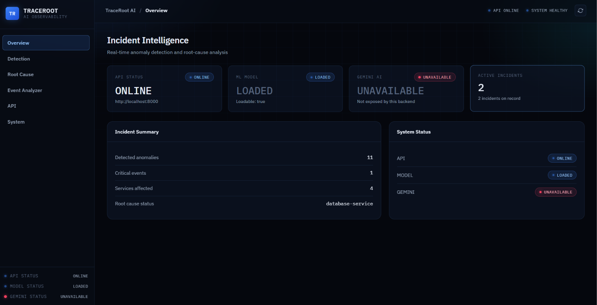
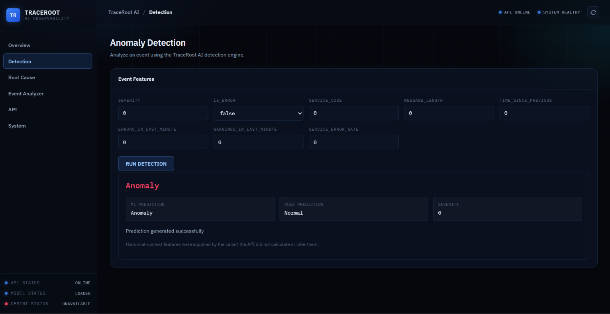
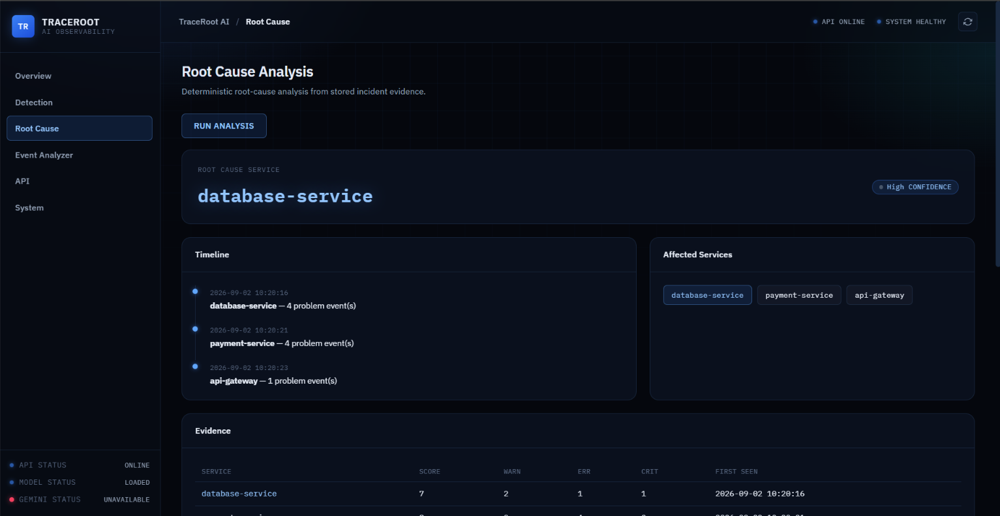

# TraceRoot AI

> AI-powered log anomaly detection and root-cause analysis platform for investigating service incidents and operational failures.

TraceRoot AI analyzes application logs to detect anomalous events, identify affected services, correlate failures, and generate structured root-cause explanations using deterministic analysis and Google Gemini.

## 🚀 Features

* 🔍 **ML-based anomaly detection** using Isolation Forest
* 🧠 **Root-cause analysis** based on service and event correlation
* ✨ **Gemini-powered incident explanations**
* 🛡️ **Deterministic fallback** when Gemini is unavailable
* 📊 **Interactive monitoring dashboard**
* ⚡ **FastAPI REST API**
* 🧪 **79 automated tests passing**
* 🐳 **Docker deployment support**
* 📖 **Swagger and ReDoc API documentation**


## 📸 Dashboard Preview

### Main Dashboard


### Anomaly Detection


### Root-Cause Analysis



## 🏗️ Architecture

```text
Application Logs
       │
       ▼
Log Preprocessing
       │
       ▼
Feature Engineering
       │
       ▼
Isolation Forest
Anomaly Detection
       │
       ▼
Incident & Event Correlation
       │
       ▼
Root-Cause Analysis
       │
       ├───────────────┐
       ▼               ▼
Deterministic       Google Gemini
Analysis            Explanation
       │               │
       └───────┬───────┘
               ▼
          FastAPI API
               │
               ▼
        Web Dashboard
```

## 🤖 Machine Learning

TraceRoot AI uses an **Isolation Forest** model for unsupervised anomaly detection.

### Features

The model uses engineered features including:

* Log severity
* Error indicator
* Service code
* Message length
* Time since previous event
* Errors within a recent time window
* Warnings within a recent time window
* Service error rate

The system combines the ML prediction with severity-based rules to produce a hybrid anomaly signal.

## 🧠 Root-Cause Analysis

The root-cause pipeline analyzes:

1. Earliest problematic event
2. Event severity
3. Service-level error patterns
4. Temporal relationships between events
5. Downstream failures
6. Service-level scores

The deterministic analysis provides the evidence used to identify the probable root-cause service.

When Gemini is available, that evidence is passed to the Gemini explanation layer to generate a structured incident explanation.

Gemini is used as an **explanation layer**, rather than being solely responsible for determining the root cause.

## ✨ Gemini Integration

Gemini generates structured output containing:

* Probable root cause
* Affected services
* Evidence
* Potential impact
* Recommended investigation steps

If Gemini is unavailable or an API request fails, TraceRoot AI automatically falls back to its deterministic explanation.

This allows the core analysis pipeline to continue operating without depending entirely on an external AI service.

## 📊 Dashboard

The web dashboard provides visibility into:

* System health
* ML model status
* Gemini availability
* Detected anomalies
* Incidents
* Root-cause analysis
* Project metrics
* API status

## 🛠️ Technology Stack

| Category         | Technologies                   |
| ---------------- | ------------------------------ |
| Programming      | Python                         |
| Backend          | FastAPI, Pydantic, Uvicorn     |
| Machine Learning | Scikit-learn, Isolation Forest |
| Data Processing  | Pandas, NumPy                  |
| Generative AI    | Google Gemini API              |
| Frontend         | HTML, CSS, JavaScript          |
| Testing          | Pytest, FastAPI TestClient     |
| Deployment       | Docker                         |
| Version Control  | Git, GitHub                    |

## 📁 Project Structure

```text
traceroot-ai/
│
├── data/
│   ├── raw/
│   └── processed/
│
├── src/
│   ├── ai/
│   │   ├── gemini_service.py
│   │   └── root_cause_analyzer.py
│   │
│   ├── analysis/
│   ├── api/
│   │   ├── app.py
│   │   ├── main.py
│   │   └── schemas.py
│   │
│   ├── processing/
│   └── ml/
│
├── tests/
│
├── ui/
│   ├── index.html
│   ├── styles.css
│   └── app.js
│
├── Dockerfile
├── requirements.txt
└── README.md
```

## 🔌 API Endpoints

| Method | Endpoint| Purpose |
| ---| --- | --- |
| GET    | `/`                               | API information               |
| GET    | `/health`                         | Service and dependency health |
| POST   | `/predict`                        | Predict log anomaly           |
| POST   | `/api/v1/predict`                 | Versioned anomaly prediction  |
| GET    | `/api/v1/anomalies`               | Retrieve anomaly results      |
| GET    | `/api/v1/incidents`               | Retrieve incidents            |
| GET    | `/api/v1/incidents/{incident_id}` | Retrieve a specific incident  |
| GET    | `/api/v1/root-cause-analysis`     | Retrieve root-cause analysis  |
| GET    | `/api/v1/metrics`                 | Retrieve project metrics      |
| GET    | `/docs`                           | Swagger API documentation     |
| GET    | `/redoc`                          | ReDoc API documentation       |

## 💻 Running Locally

### 1. Clone the repository

```bash
git clone https://github.com/poojithadharmapuri023-pixel/traceroot-ai.git
cd traceroot-ai
```

### 2. Create a virtual environment

Windows:

```powershell
python -m venv venv
venv\Scripts\activate
```

### 3. Install dependencies

```powershell
pip install -r requirements.txt
```

### 4. Configure Gemini

Create a `.env` file in the project root:

```text
GEMINI_API_KEY=your_api_key_here
```

**Never commit your `.env` file or API key to GitHub.**

### 5. Start the backend

```powershell
python -m uvicorn src.api.main:app --reload --port 8000
```

Backend:

```text
http://localhost:8000
```

Swagger:

```text
http://localhost:8000/docs
```

### 6. Start the dashboard

Open a second terminal:

```powershell
cd ui
python -m http.server 5500
```

Dashboard:

```text
http://localhost:5500
```

## 🐳 Docker

Build the image:

```bash
docker build -t traceroot-ai .
```

Run the container:

```bash
docker run --env-file .env -p 8000:8000 traceroot-ai
```

## 🧪 Testing

Run the complete test suite:

```powershell
python -m pytest -q
```

Current result:

```text
79 passed
1 warning
```

The test suite covers:

* API endpoints
* Response validation
* Error handling
* Integration behavior
* ML model behavior
* Preprocessing and feature engineering
* Quality assurance
* OpenAPI metadata
* Health checks

## 🔐 Security

* API credentials are loaded through environment variables.
* `.env` is excluded from version control.
* Gemini API credentials should never be committed to the repository.
* Production deployments should use secure secrets management.

## 🔮 Future Improvements

* Real-time log streaming
* Larger production log datasets
* Advanced anomaly detection models
* Service dependency graphs
* RAG-based incident history retrieval
* Automated incident summaries
* Cloud deployment
* Authentication and role-based access
* Observability integrations
* Larger-scale model evaluation

## 📌 Project Status

**Completed and tested**

* ✅ End-to-end ML pipeline
* ✅ FastAPI backend
* ✅ Interactive dashboard
* ✅ Root-cause analysis
* ✅ Gemini integration
* ✅ Deterministic fallback
* ✅ Docker configuration
* ✅ Automated testing
* ✅ 79 tests passing

## 👩‍💻 Author

**Poojitha Dharmapuri**

B.Tech Computer Science & Engineering
Methodist College of Engineering & Technology
